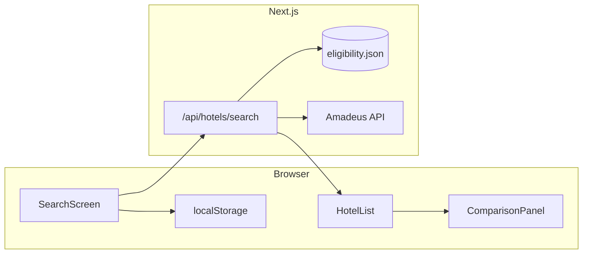

# HotelRwd Phase 1 MVP — Implementation Plan

**Status dashboard:** [tasks/mvp/STATUS.md](../../tasks/mvp/STATUS.md)

> **For agentic workers:** REQUIRED SUB-SKILL: Use **superpowers:subagent-driven-development** (recommended) or **superpowers:executing-plans** to implement task-by-task. Steps use checkbox (`- [ ]`) syntax. Track work via `tasks/backlog/MVP-*.md` (active) and `tasks/done/` (complete).

**Goal:** Ship the PRD Phase 1 MVP — a single **SEARCH** screen where users select cards, optionally set a CPP target, search by destination/dates, browse a ranked/filterable hotel list, and open a per-hotel three-path comparison panel with deep links to portals.

**Architecture:** Next.js 14 App Router with a **client-heavy search UI** and **server API routes** for retail price lookups (keeps API keys off the client). Program eligibility, card benefits, quality signals, and portal deep-link templates live in **versioned static JSON** under `src/data/` (monthly manual refresh per PRD). User card selection and CPP target persist in **localStorage** only (PRD §8 Source 5). No auth, no booking, no balance tracking.

**Tech stack:** Next.js 14, React 18, TypeScript, CSS Modules or global CSS variables (no new UI framework unless needed), Vitest + React Testing Library, Amadeus Hotel Search API (primary; Expedia Rapid as documented fallback).

**PRD anchors:** [docs/prd/PRD.md](../prd/PRD.md) §5 (Features 1–4), §8 (Data), §9 (Flows), §10–12 (UX/Design/Nav), §13 Phase 1 row.

---

## Current baseline

- App shell: [globals.css](../../src/app/globals.css), [layout.tsx](../../src/app/layout.tsx), [AppHeader.tsx](../../src/components/shared/AppHeader.tsx).
- Search MVP slice: [SearchScreen.tsx](../../src/components/search/SearchScreen.tsx), static data under `src/data/`, Vitest + tests in `src/lib/__tests__/`.
- Retail API routes not built yet (Task 6).

---

## Target file map

| Area | Files |
| ---- | ----- |
| App shell | `src/app/layout.tsx`, `src/app/globals.css` |
| Main screen | `src/app/page.tsx` (orchestrates search + results + panel) |
| API | `src/app/api/hotels/search/route.ts` |
| Components | `src/components/search/*`, `src/components/hotels/*`, `src/components/shared/*` |
| Domain logic | `src/lib/cards.ts`, `cpp.ts`, `eligibility.ts`, `hotels.ts`, `filters.ts`, `sort.ts`, `deep-links.ts`, `storage.ts` |
| Types | `src/lib/types.ts` |
| Static data | `src/data/cards.json`, `eligibility.json`, `quality.json`, `benefits.json` |
| Tests | `src/lib/__tests__/*.test.ts`, `src/components/**/__tests__/*` |
| Config | `.env.local.example` (Amadeus keys), update [package.json](../../package.json) scripts |



---

## Design system (PRD §11)

Lock in `globals.css` CSS variables before building UI:

- `--bg: #F7F5F0`
- `--teal: #0F6E56` (winning path, CTAs, CPP pass)
- `--amber` for CPP below-target (e.g. `#B45309`)
- Serif italic for destination/hotel hero; monospace for prices/labels/data
- Hairline borders only; no drop shadows
- Program pills: `FHR`, `EDIT`, `CERT`, `C1`, `DIRECT`
- Quality pills: `NEW`, `RENOVATED` (distinct color from program pills)

---

## Data model (types in `src/lib/types.ts`)

```typescript
export type Program = "FHR" | "EDIT" | "CERT_35K" | "CERT_50K" | "C1_PREMIER" | "DIRECT";

export type CardId =
  | "amex_platinum"
  | "chase_csr"
  | "capital_one_venture_x"
  | "marriott_boundless";

export interface CardDefinition {
  id: CardId;
  label: string;
  programs: Program[];
  infoPanel: { title: string; bullets: string[] };
}

export interface HotelProperty {
  id: string;
  name: string;
  brand: string;
  city: string;
  neighborhood?: string;
  starRating?: number;
  programs: Program[];
  quality?: ("NEW" | "RENOVATED")[];
  marriottCategory?: number;
  portalIds: { amex?: string; chase?: string; marriott?: string; capitalOne?: string; directUrl: string };
}

export interface RetailQuote {
  hotelId: string;
  pricePerNight: number;
  currency: string;
  source: "amadeus" | "mock";
}

export interface SearchResult extends HotelProperty {
  retail?: RetailQuote;
  benefitSummary: string;
  recommendedPath?: Program;
}

export interface ComparisonPath {
  pathId: string;
  label: string;
  portalEstimate: string;
  cardBenefit: string;
  cpp?: { value: number; meetsTarget: boolean };
  notes: string;
  deepLink?: string;
}
```

---

## Implementation tasks

### Task 1: Tooling and design foundation

**Done:** [MVP-001-tooling.md](../../tasks/done/MVP-001-tooling.md)

**Files:** Modify `package.json`; create `src/app/globals.css`; update `src/app/layout.tsx`.

- [x] Add dev deps: `vitest`, `@vitejs/plugin-react`, `@testing-library/react`, `@testing-library/jest-dom`, `jsdom`; add `"test": "vitest run"` script.
- [x] Add `vitest.config.ts` with `@/` path alias matching [tsconfig.json](../../tsconfig.json).
- [x] Create `globals.css` with PRD design tokens; import in layout.
- [x] Load fonts in layout (e.g. Google: serif italic for hero + monospace for data — `Lora` + `IBM Plex Mono` or similar).
- [x] Add top bar stub: date · time · `● RATES LIVE` (PRD §12).

**Verify:** `npm run build` and `npm run lint` pass.

---

### Task 2: Static card and CPP domain data

**Done:** [MVP-002-cards-cpp.md](../../tasks/done/MVP-002-cards-cpp.md)

**Files:** `src/data/cards.json`, `src/lib/cards.ts`, `src/lib/cpp.ts`, `src/lib/__tests__/cpp.test.ts`.

- [x] Define 4 MVP cards with ⓘ panel content (programs, credit amounts, min stays) per PRD §5 Feature 1 and glossary.
- [x] Implement CPP presets: `1.5`, `1.8`, `2.0`, `2.5`, custom; default benchmarks: MR 2.0, UR 1.8, C1 1.85, Bonvoy 0.7 (PRD §5).
- [x] `evaluateCpp(pointsCost, cashValueUsd, currency, userTargetCpp?)` → `{ cpp, meetsTarget, benchmarkUsed }`; UI uses `CPP_BENCHMARK_LABEL` when target cleared.

**Test (write first):**

```typescript
it("flags redemption above user target", () => {
  expect(evaluateCpp(50000, 1100, "MR", 2.0).meetsTarget).toBe(true);
});
it("uses Bonvoy benchmark when user sets unrealistic target", () => {
  expect(evaluateCpp(35000, 245, "Bonvoy", 2.0).meetsTarget).toBe(true);
});
```

---

### Task 3: Eligibility database (static JSON)

**Done:** [MVP-003-eligibility.md](../../tasks/done/MVP-003-eligibility.md)

**Files:** `src/data/eligibility.json`, `src/data/quality.json`, `src/data/benefits.json`, `src/lib/eligibility.ts`, `src/lib/__tests__/eligibility.test.ts`.

- [x] Seed **10–20 real properties** across 2–3 cities with multi-program overlap (FHR + EDIT on same hotel).
- [x] `getEligibleHotels(city, dates, selectedCardIds)` → filters properties where `programs` intersect user's unlocked programs.
- [x] Map benefits per path from `benefits.json` (fixed values only — no balances).

**Test:** Kimpton-like property returns both `FHR` and `EDIT` badges when user holds Amex + Chase.

---

### Task 4: localStorage persistence

**Done:** [MVP-004-local-storage.md](../../tasks/done/MVP-004-local-storage.md)

**Files:** `src/lib/storage.ts`, `src/hooks/useUserPrefs.ts` (optional hook).

- [x] Keys: `hotelrwd:cards`, `hotelrwd:cppTarget` (number or null).
- [x] SSR-safe: only read/write in `useEffect` / client components.
- [x] Returning user flow: cards + CPP restored on load (PRD §9).

---

### Task 5: Search screen UI (Feature 1)

**Done:** [MVP-005-search-ui.md](../../tasks/done/MVP-005-search-ui.md)

**Files:** `src/components/search/CardSelector.tsx`, `CardInfoPanel.tsx`, `CppTargetInput.tsx`, `SearchForm.tsx`, `SearchScreen.tsx`, wire in `src/app/page.tsx`.

- [x] Card toggles with ⓘ opening dismissible panel (tap outside to close).
- [x] CPP optional field + preset chips + custom input; show benchmark label when empty.
- [x] Destination (city text) + check-in/check-out date inputs.
- [x] **No setup wall:** all on one screen; search CTA enabled when city + dates valid and ≥1 card selected.
- [x] Bloomberg-terminal density: compact horizontal card row, monospace labels.

---

### Task 6: Retail price API route (Feature 4)

**Backlog:** [MVP-006-retail-api.md](../../tasks/backlog/MVP-006-retail-api.md)

**Files:** `src/app/api/hotels/search/route.ts`, `src/lib/hotels/amadeus.ts`, `.env.local.example`.

- [ ] `POST /api/hotels/search` body: `{ city, checkIn, checkOut, hotelIds[] }`.
- [ ] Call Amadeus for matching IDs; return `RetailQuote[]`.
- [ ] **Dev fallback:** if `AMADEUS_API_KEY` missing, return deterministic mock prices keyed by `hotelId`.
- [ ] Every price response includes disclaimer metadata for UI.

**Verify:** `curl` POST returns quotes for seeded hotel IDs.

---

### Task 7: Search orchestration and hotel list (Feature 2)

**Backlog:** [MVP-007-hotel-list.md](../../tasks/backlog/MVP-007-hotel-list.md)

**Files:** `src/lib/hotels/search.ts`, `src/components/hotels/HotelList.tsx`, `HotelCard.tsx`, `ProgramBadge.tsx`, `QualityChip.tsx`, `FilterBar.tsx`, `SortControls.tsx`.

- [ ] On search: eligibility filter → fetch retail via API → merge into `SearchResult[]`.
- [ ] Hotel card: name, brand, stars, neighborhood, badges, quality chips, retail/night, benefit summary, CPP indicator, `View on [Portal] →`.
- [ ] Sort: best value (default), by program, retail price, quality.
- [ ] Filter: program, price range, brand, cert 35K/50K (Marriott card only), quality, CPP-pass-only.
- [ ] Default view: top 5–8 by best value; optional "show all".

---

### Task 8: Three-path comparison panel (Feature 3)

**Backlog:** [MVP-008-comparison-panel.md](../../tasks/backlog/MVP-008-comparison-panel.md)

**Files:** `src/components/hotels/ComparisonPanel.tsx`, `src/lib/comparison.ts`, `src/lib/deep-links.ts`.

- [ ] Expandable panel on hotel card tap.
- [ ] Rows: Chase Edit, Amex FHR, Marriott cert, C1 Premier, Direct, Cash retail.
- [ ] Overlap callout when hotel has 2+ portal programs.
- [ ] Deep links to **specific hotel** on each portal.

---

### Task 9: CPP indicators in list and panel

**Backlog:** [MVP-009-cpp-indicators.md](../../tasks/backlog/MVP-009-cpp-indicators.md)

**Files:** extend `HotelCard`, `ComparisonPanel`; use `cpp.ts`.

- [ ] List-level CPP badge on points-capable properties.
- [ ] Panel: ✔ teal / ⚠ amber per PRD §11.
- [ ] When no user target, show subtext referencing TPG benchmarks.

---

### Task 10: Header, polish, accessibility

**Backlog:** [MVP-010-polish.md](../../tasks/backlog/MVP-010-polish.md)

**Files:** `src/components/shared/Header.tsx`, refine `page.tsx`.

- [ ] Live clock + `● RATES LIVE` when API source is live (not mock).
- [ ] Keyboard: panel dismiss Esc; focus trap in info panel.
- [ ] Empty states: no hotels for city, no cards selected nudge.
- [ ] Metadata: update layout title/description with PRD tagline.

---

### Task 11: Verification

**Backlog:** [MVP-011-verification.md](../../tasks/backlog/MVP-011-verification.md)

- [ ] Run `npm run test`, `npm run lint`, `npm run build`.
- [ ] Manual test script (PRD §9 flows): first-time, returning user, CPP optimizer, Marriott cert.
- [ ] Document env setup in `.env.local.example`.

**Out of scope:** Phase 0 waitlist, Phase 2 balance tracking, Explore tab, live portal prices, flights, auth, server-side user data.

---

## API and env

```bash
# .env.local.example
AMADEUS_API_KEY=
AMADEUS_API_SECRET=
# Optional: AMADEUS_HOST=https://test.api.amadeus.com
```

Use **test** Amadeus environment until production keys approved.

---

## Risk mitigations

| Risk | MVP approach |
| ---- | ------------ |
| Eligibility DB drift | Curated JSON; document monthly update in `src/data/README.md` |
| Retail vs portal price gap | Disclaimer under every retail figure |
| Direct rate gaps | Direct row with fallback link |
| Sparse quality data | Only render chips when present in `quality.json` |
| No live portal prices | Portal column = `— check portal` + deep link |

---

## Suggested commit sequence

1. `chore: add vitest and design tokens`
2. `feat: card definitions and CPP engine`
3. `feat: eligibility static data and filters`
4. `feat: search screen with localStorage prefs`
5. `feat: amadeus search API with mock fallback`
6. `feat: hotel list with sort and filters`
7. `feat: three-path comparison panel and deep links`
8. `docs: mvp manual test checklist`

---

## Spec coverage self-check

| PRD requirement | Task |
| --------------- | ---- |
| Feature 1 — Search + cards + CPP | 2, 4, 5 |
| Feature 2 — Discovery list | 3, 7 |
| Feature 3 — Comparison panel | 8, 9 |
| Feature 4 — Retail baseline | 6, 7 |
| UX principles §10 | 5, 7, 8, 10 |
| Design language §11 | 1 |
| Single SEARCH nav §12 | 5, 10 |
| Phase 1 success gate | 11 |

**Gaps deferred by design:** personalized net cost, balance tracking, Explore, live portal pricing — all Phase 2+ per PRD.
